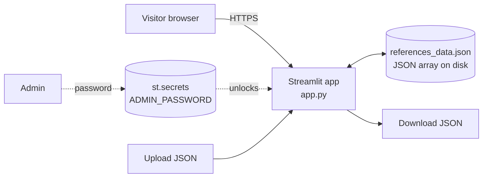

<div align="center">

# 📚 EMA References

**Interactive Streamlit bibliography for an HTW Berlin M8 course presentation on the European Medicines Agency's first oral hearing and the growing role of patient engagement in EU medical regulation.**

[](https://presentation-references.streamlit.app/)
[](LICENSE)
[](https://www.python.org/)
[](https://streamlit.io/)
[](#academic-context)
[](#project-status)

[Live demo](https://presentation-references.streamlit.app/) · [Features](#features) · [Architecture](#architecture) · [Run locally](#run-locally) · [Deploy](#deploy) · [Security](#security)

</div>

---

## Overview

**EMA References** is a small Streamlit app that organises the references behind an HTW Berlin M8 course presentation:

> *How EMA's First Oral Hearing Spotlighted Patient Collaboration — Increasing Recognition of Patient Engagement in EU Medical Regulation*

Visitors can browse and search the bibliography in a clean, structured layout. Owners with the admin password can add, edit, delete, back up, and restore references through the same UI — no separate CMS.

## Project status

| | |
|---|---|
| **Phase** | Concept / academic deliverable |
| **Course module** | M8 — HTW Berlin |
| **Live URL** | <https://presentation-references.streamlit.app/> |
| **Persistence** | A single JSON file (`references_data.json`) in the app's working directory |
| **Auth** | One shared admin password (Streamlit secret) — adequate for an academic demo, *not* for production |

## Features

| | |
|---|---|
| 🔍 **Search** | Live filtering across `title`, `description`, `type` |
| 📂 **Typed references** | Article · Journal Paper · Report · Guideline · Website · Video · Presentation · Other |
| 🛠️ **Admin CRUD** | Add / edit / delete entries — gated by a single password held in `st.secrets` |
| 💾 **Backup & restore** | One-click JSON download; upload a JSON file to overwrite the store |
| 🪶 **Single file** | `app.py` is the entire application; data is a flat JSON array |
| 🚀 **Zero infra** | Runs on free Streamlit Community Cloud; no database, no queue, no worker |

## Architecture



- **State** lives in `st.session_state` for the duration of a Streamlit session.
- **Persistence** is the simplest possible thing: rewrite the JSON file on every mutation. There is no concurrency control — if two admins edit at the same time, the last write wins.
- **Auth** is intentionally minimal — a single password, no users, no roles. Suitable for an academic demo; not a multi-tenant CMS.

## Data model

Each reference is a flat JSON object:

```json
{
  "id": "01cf6d7f-e492-49fc-85c8-66e279526799",
  "title": "How is machine learning used in medicine?",
  "type": "Website",
  "url": "https://eithealth.eu/news-article/...",
  "description": "Short summary of the source.",
  "date": "2025-05-07 17:44:53",
  "updated": "2025-05-07 18:00:09"
}
```

| Field | Type | Notes |
|---|---|---|
| `id` | string | UUID v4 assigned at creation |
| `title` | string | Required |
| `type` | string | One of the eight categories listed in [Features](#features) |
| `url` | string | Required |
| `description` | string | Optional |
| `date` | string | First-saved timestamp (`YYYY-MM-DD HH:MM:SS`) |
| `updated` | string \| absent | Last-edit timestamp; absent until first edit |

The whole dataset is a JSON array of these — small (~tens of KB), trivially diffable, easy to back up.

## Run locally

### Prerequisites

- **Python 3.10+**
- A copy of the repo

### Install and start

```bash
git clone https://github.com/ugrersoz/ema-references.git
cd ema-references

python -m venv .venv
.venv\Scripts\activate              # Windows
# source .venv/bin/activate         # macOS / Linux

pip install -r requirements.txt
```

### Configure the admin password

```bash
cp .streamlit/secrets.toml.example .streamlit/secrets.toml
# edit .streamlit/secrets.toml — replace the placeholder with a long, random string
```

Or as an environment variable, if you don't want a secrets file:

```powershell
$env:ADMIN_PASSWORD = "change-me-to-a-long-random-string"  # Windows PowerShell
```

```bash
export ADMIN_PASSWORD="change-me-to-a-long-random-string"  # macOS / Linux
```

If neither is set, the admin login form **refuses to authenticate at all** — the app is read-only.

### Run

```bash
streamlit run app.py
# default: http://localhost:8501
```

## Deploy

The live demo runs on [Streamlit Community Cloud](https://streamlit.io/cloud). To deploy your own copy:

1. Push to GitHub.
2. On Streamlit Cloud → **Create app** → connect the repo, point at `app.py`.
3. **App settings → Secrets** → paste the contents of `.streamlit/secrets.toml.example` with a real, long random `ADMIN_PASSWORD`.
4. Deploy. Future pushes to `main` auto-redeploy.

> ⚠️ **The previous `admin123` default is permanently considered compromised.** It lived in the public Git history and was therefore visible to anyone reading the repo. After cloning, **set a fresh random password in Streamlit Cloud Secrets before re-enabling admin mode**.

## Project structure

```
ema-references/
├── app.py                                 # Single-file Streamlit application (~250 lines)
├── references_data.json                   # The bibliography itself
├── requirements.txt                       # streamlit + pandas
├── archive/
│   └── app_v0.py                          # Historical snapshot, kept for reference
├── .devcontainer/
│   └── devcontainer.json                  # Dev container config (for GitHub Codespaces)
├── .streamlit/
│   └── secrets.toml.example               # Template; real secrets.toml is gitignored
├── .gitignore
├── CONTRIBUTING.md
├── LICENSE                                # MIT
└── README.md
```

## Security

This is a public repository — treat anything in `app.py` as published.

- **Admin password** lives in `st.secrets["ADMIN_PASSWORD"]` (or the `ADMIN_PASSWORD` env var as a fallback). Never inline it.
- **Fail-closed login**: if no admin password is configured, the login form actively refuses to authenticate. There is no implicit empty-string match.
- **No CSRF token** on form submits, no rate limiting on the admin password attempt — the threat model is a single trusted operator on a small Streamlit Cloud deployment, not a public CMS. Don't pivot this app into the latter without revisiting both.
- **JSON store** is owner-writable on disk. On Streamlit Community Cloud the filesystem is ephemeral — restart resets to whatever is in the repo's `references_data.json`. Use the **Download / Upload** controls in the UI as your backup workflow.

If you spot a security issue, please open a private GitHub issue or contact the author directly rather than posting it in a public thread.

## Roadmap

- [ ] **pytest smoke suite** — JSON round-trip, search filter, login gate
- [ ] **Tag-based filtering** in addition to the existing type filter
- [ ] **Citation export** (BibTeX / RIS) so the bibliography can be reused in LaTeX / Word
- [ ] **Read-only sharing link** — public view, private edit, both via secret
- [ ] **Optimistic locking** on `references_data.json` (timestamp guard) to prevent the last-write-wins race when two admins edit at once
- [ ] **Per-user admin accounts** — replace the single shared password
- [ ] **Move from JSON file to SQLite** if the bibliography grows past a few hundred entries

## Academic context

| | |
|---|---|
| **Institution** | [HTW Berlin](https://www.htw-berlin.de/) — University of Applied Sciences |
| **Module** | M8 |
| **Presentation** | *How EMA's First Oral Hearing Spotlighted Patient Collaboration* |
| **Submission** | 2025 |

## Author

**Uğur Ersöz** — [@ugrersoz](https://github.com/ugrersoz)

## License

Distributed under the **MIT License**. See [LICENSE](LICENSE).

---

<div align="center">
<sub>Built at HTW Berlin · 2025 · Streamlit · Python</sub>
</div>
